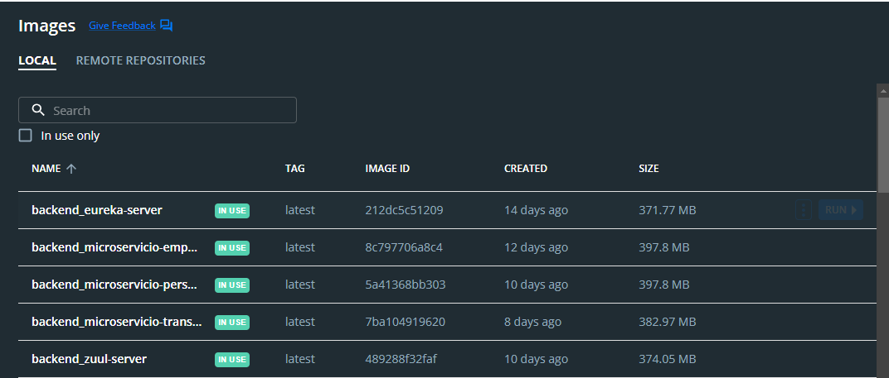
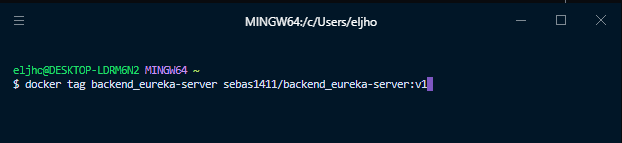
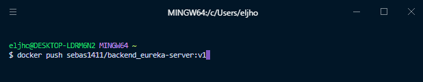
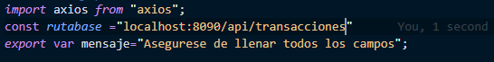
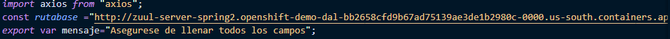
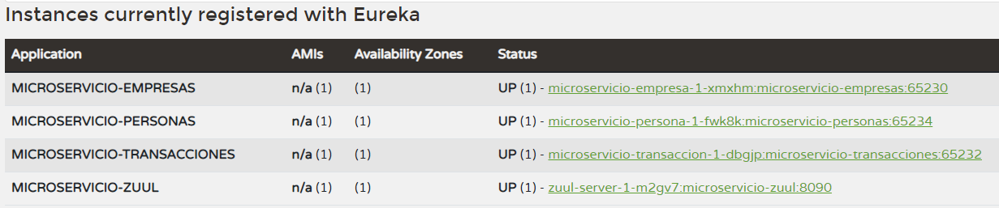
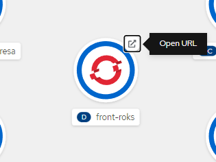
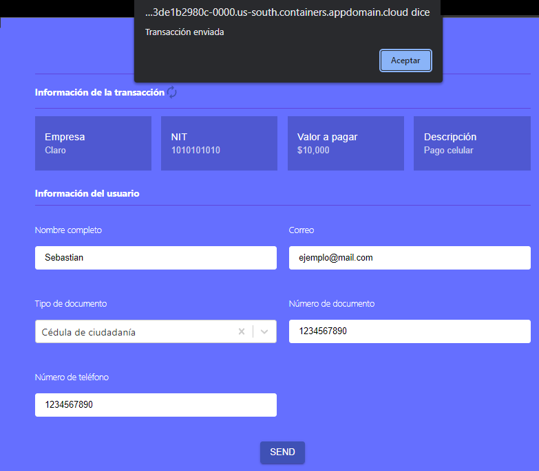

# Microservicios Spring Boot App PostgreSQL :desktop_computer:

En la presente guía encontrará el paso a paso y las herramientas necesarias para el despliegue en un clúster de Red Hat OpenShift de una aplicación de transacciones bancarias, que fue desarrollada siguiendo la arquitectura de microservicios y que podrá obtener al clonar el presente repositorio.


### Contenido

1.  [Pre-requisitos](#Pre-Requisitos-pencil)
2.  [Crear un proyecto](#crear-un-proyecto-pagefacingup)
3.  [Despliegue de la base de datos PostgreSQL.](#despliegue-de-la-base-de-datos-postgresql)
4.  [Creación de las imágenes](#creación-de-las-imágenes)
5.  [Despliegue de los microservicios](#despliegue-de-los-microservicios)
6.  [Despliegue FrontEnd.](#despliegue-frontend)
7.  [Prueba de funcionamiento.](#prueba-de-funcionamiento)
8.  [Referencias.](#referencias)
9.  [Autores.](#autores)

## Pre-Requisitos :pencil:
* Tener una cuenta en IBM Cloud
* Contar con un clúster de RedHat Openshift
* Tener instalado [kompose](https://kompose.io/)
* Tener una cuenta en [Docker Hub](https://hub.docker.com/) :whale:
* Acceso a IBM Cloud CLI a través de IBM Cloud Shell :cloud:

## Crear un proyecto :page_facing_up:

**Paso 1:** En la sección **clústeres** de la lista de recursos ingrese al suyo y dé clic en el botón **Consola web de OpenShift.** Una vez se encuentre en la consola fíjese que se encuentre como **Developer** y no como **Administrator.**

**Paso 2:** Cree un nuevo proyecto abriendo el menú desplegable de **Project** y luego dé clic en **Create Project.** Proporcione un nombre relacionado con la aplicación y haga clic en **Crear.**


## Despliegue de la base de datos PostgreSQL

**Paso 1:** Haga clic en **+Add** y luego elija la opción **Database.** En el menú de la izquierda puede filtrar dependiendo de la base de datos que necesite, en este caso seleccione el filtro **Postgres**, elija la primera opción **PostgreSQL** y haga clic en **Instantiate Template.**

**Paso 2:** En las variables requeridas puede dejar los valores por defecto, sin embargo es importante que modifique 3 variables con los valores mostrados en la lista a continuación. Tenga en cuenta que estos valores se configuran en el código de la aplicación y en caso de querer modificarlos puede hacerlo desde el archivo **/src/main/resources/application.properties** de cada microservicio: empresa, persona y transacciones.

*   **Database Service Name:** postgresql
*   **PostgreSQL Connection Username:** postgresadmin
*   **PostgreSQL Connection Password:** Passw0rd2020


**Paso 3:** Ingrese a la IBM Cloud Shell dando clic en el ícono de **IBM Cloud Shell** desde su cuenta o mediante el [link.](https://cloud.ibm.com/shell). 

Inicie sesión en el clúster con el comando ```Copy login command``` que puede encontrar al dar clic en su nombre de usuario en la esquina superior derecha de la consola de OpenShift.

Ingrese al proyecto que creó con el siguiente comando:

```shell
oc project <nombre_proyecto>
```
Por ejemplo:
```
oc project microservicios-spring-boot-postgresql
```

**Paso 4:** Exponga la base de datos como un servicio mediante el comando:

```shell
oc expose service <nombre_servicio>
```
En este caso:
```
oc expose service postgresql
```

**Paso 5:** Obtenga la IP y el puerto en la cual fue expuesto el servicio, guárdela como \<IP\_Servicio>

```shell
oc get svc
```


## **Creación de las imágenes**
Con el fin de desplegar los microservicios usando la base de datos desplegada previamente, es necesario crear las imágenes respectivas localmente y subirlas a un repositorio de docker.

**Paso 1:** 

En la terminal de su computador, muévase a la carpeta **BackEnd** donde encontrará el archivo ```docker-compose.yml```, el cual creará todas las imágenes configuradas para el despliegue, luego en la consola ejecute el siguiente comando:

```
docker-compose up
```

Puede verificar que las imágenes se construyeron usando el siguiente comando 

```
docker images
```
O usando docker desktop:




**Paso 2**

Ahora deberá taggear cada imagen para subirlas al repositorio de su elección, en este caso usamos el repositorio docker hub.

Para cada imagen de cada microservicio el nombre tiene que tener la siguiente estructura:

```
<nombre de usuario docker>/<nombre_imagen_microservicio>:v1
```

Por ejemplo si deseamos taggear la imagen de backend_eureka-server debe ser de la siguiente manera:

```
docker tag backend_eureka-server sebas1411/backend_eureka-server:v1
```



Este paso deberá repertilo para cada imagen de cada microservicio (backend_eureka-server, microservicios-empresa, microservicios-persona, microservicios-transacciones, microservicios-zuul).

**Paso 3**

A continuación debe hacer push al repositorio de sus imágenes recientemente taggeadas. Para lo anterior deberá ejecutar el comando:

```
docker login
```
Ingrese sus credenciales y finalmente haga push de sus imágenes usando este comando:

```
docker push <usuario docker>/<nombre imagen microservicio>:<version>
```


**Paso 4**

Finalmente, deberá modificar el archivo **docker-compose-deploy.yml** que encontrará en la ruta ```Backend/deploy```.
Para cada microservicio deberá cambiar la línea
```
image: <usuario docker>/backend_eureka-server:<version>
```

En las secciones de los microservicios **microservicio-empresa**, **microservicio-persona** y **microservicio-transaccion** agregue la IP de su servicio de base de datos en el atributo ```spring.datasource.url```
```
spring.datasource.url: jdbc:postgresql://<IP_servicio>:5432/postgresql
```

Para generar los archivos ```.yml``` con los cuales se realizará el despliegue en openshift se usará la herramienta **kompose**. Asegúrese de estar en la carpeta ```Backend/deploy``` y escriba el siguiente comando:
```
kompose --provider openshift --file docker-compose
```

Este comando creará 3 archivos ```.yml``` por cada microservicio, los cuales corresponden a imagen, deployment y servicio. Estos archivos serán los que se usen en el siguiente paso para realizar el despliegue.

## Despliegue de los microservicios

Los pasos a continuación son iguales para todos los microservicios y se aplican primero para **eureka-server**, luego **microservicios-empresa,** luego para **microservicios-persona,** posteriormente en **microservicios-transacciones** , en **microservicios-zuul**.

**Paso 1**

Ingrese a su proyecto de OpenShift a través de IBM Cloud Shell. 

**Paso 2**

Ingrese los siguientes comandos, modificando el nombre ```<microservicio>``` según el archivo a subir.

```
oc apply -f <microservicio>-imagestream.yaml
```

```
oc apply -f <microservicio>-deploymentconfig.yaml
```

```
oc apply -f <microservicio>-service.yaml
```

Verifique que se hayan realizado los despliegues correctamente con el comando
```
oc get svc
```

**Paso 3**

Finalmente, exponga los microservicios eureka y zuul, con los siguientes comandos:

```
oc expose svc eureka-server
```

```
oc expose svc zuul-server
```

Guarde el endpoint del servicio zuul para usarlo en el despliegue de FrontEnd.

## Despliegue FrontEnd
Para realizar el despliegue del FrontEnd de la aplicación, siga los pasos que se muestran a continuación:

**Paso 1:** 
Diríjase a la carpeta FrontEnd, mediante el comando:
```
cd FrontEnd
```
>**Nota:** recuerde que este paso se debe realizar desde la terminal de su computadora

**Paso 2:**

Dirigase al siguiente fichero **src/services/Transaccion.js** y edite la constante ruta base usando el endpoint de backend_zuul-server que obtuvo en el paso anterior.



Cambie ese valor por el endpoint que obtuvo:




**Paso 3:**

Ahora debe hacer construir la imagen docker del frontend, taggearla y subirla al repositorio de su elección, en este caso, es docker hub.

Ubiquese en la carpeta **FrontEnd** y ejecute los siguientes comandos:

```
docker build -t <nombre usuario docker>/front-roks:<version> .
```

Finalmente ejecute:
```
docker push <nombre usuario docker>/front-roks:<version>
```
**Paso 4:**
Entre al clúster de OpenShift y asegurese de que estar en el rol de **Developer** y diríjase a la pestaña de *+add* y luego ingrese al apartado de **Container images**.


**Paso 5:**

Seleccione la opción de *Image name from external registry* y en el campo ingrese el nombre de su imagen (el paso anterior):

```
<nombre usuario docker>/front-roks:<version>   
```

Cambie el *runtime icon* por el de node.js. Por ultimo en el campo *Name* asigne un nombre para distinguir el componente y sus recursos asociados. En este caso el nombre será: *frontend-microservice*.


Click en el botón *Create* y el despliegue empezará de manera automática.


**Nota:** Las opciones de configuración que no se mencionan en este apartado no necesitan ser modificadas.


## Prueba de funcionamiento
Para verificar el funcionamiento de la aplicación realice los siguientes pasos:

**Paso 1:** Entre al clúster de OpenShift y abra la **Consola web de OpenShift**.

**Paso 2:** Asegurese de tener seleccionado el rol de **Developer** y posteriormente diríjase a la pestaña de *Topology*.

**Paso 3:** Busque en el proyecto en el que esta trabajando y seleccione el recurso **eureka-server** y de click en **Open URL** los microservicios deben estar registrados en el servidor de eureka como en esta imagen:


**Paso 3:** Busque el proyecto en el cual está trabajando, seleccione el recurso **node.js** sobre el realizó la implementación del FrontEnd y de click en **Open URL**.


**Paso 4:** Si realizó todos los pasos correctamente debe observar la aplicación de forma similar a como se muestra en la siguiente imagen:


## Referencias

La documentación sobre odo puede encontrarla en la página de [Red Hat OpenShift](https://docs.openshift.com/container-platform/4.2/cli_reference/openshift_developer_cli/understanding-odo.html).

## Autores

IBM Cloud Tech Sales :cloud:
